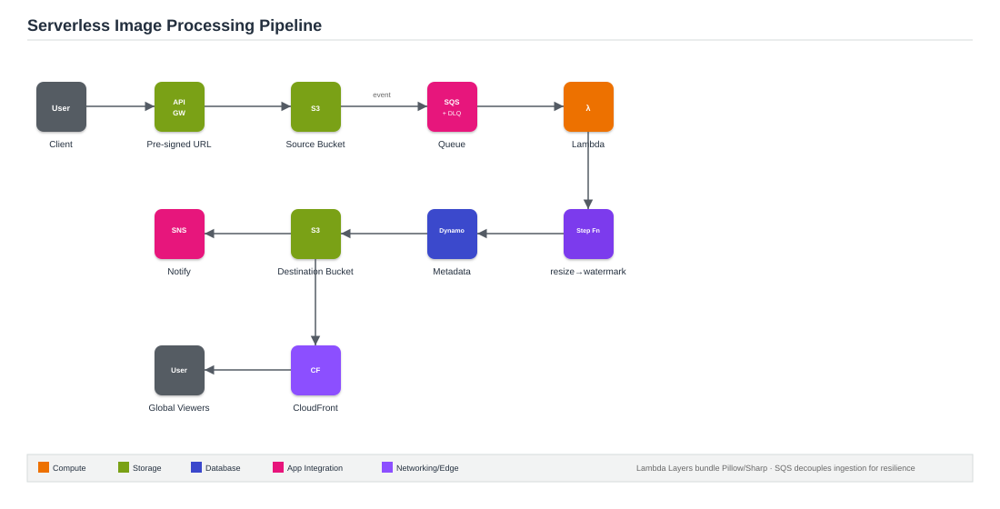

# Project 2: Serverless Image Processing Pipeline with S3, SQS & Lambda

**Architecture type:** Serverless, event-driven

## Table of Contents
- [Solution Overview](#solution-overview)
- [Architecture Diagram](#architecture-diagram)
- [Key AWS Services](#key-aws-services)
- [How It Works](#how-it-works)
- [Deploying This Solution](#deploying-this-solution)
- [Learning Outcomes](#learning-outcomes)
- [Cost Considerations](#cost-considerations)
- [Possible Enhancements](#possible-enhancements)
- [License](#license)

## Solution Overview
This project builds a serverless image processing pipeline. Uploads to a source S3 bucket publish events to an SQS queue, decoupling ingestion from processing. A Lambda function polls the queue, resizes and watermarks each image, then stores results in a destination S3 bucket. Step Functions orchestrate the multi-step workflow (thumbnail, full-res, metadata extraction), and CloudFront serves the processed images globally.

## Architecture Diagram

*Figure 1: Upload flow from client through API Gateway, S3, SQS, and Lambda, with Step Functions orchestrating the processing stages and CloudFront serving results.*

## Key AWS Services
| Service | Role |
|---|---|
| S3 (source & destination) | Bucket policies, lifecycle rules, event notifications |
| SQS + DLQ | Decouples events from processing; captures failed messages |
| Lambda | Resize/watermark logic; Lambda Layers for Pillow/Sharp |
| Step Functions | Orchestrates validate → resize → watermark → store |
| API Gateway | Issues pre-signed S3 upload URLs |
| DynamoDB | Stores image metadata (upload time, dimensions, status) |
| CloudFront | Serves processed images with low global latency |
| SNS | Notifies on job completion or failure |

## How It Works
1. A client requests a pre-signed upload URL from API Gateway (backed by a small Lambda).
2. The client uploads the image directly to the S3 source bucket using that URL.
3. The S3 upload event publishes a message to an SQS queue (with a DLQ for failed messages).
4. A Lambda function, using a Lambda Layer bundling Pillow/Sharp, is invoked (directly or via Step Functions for a multi-stage workflow), resizing and watermarking the image.
5. The processed image is written to the S3 destination bucket; metadata (dimensions, timestamps, status) is written to DynamoDB.
6. SNS publishes a completion or failure notification.
7. CloudFront serves the processed images to end users with low latency.

## Deploying This Solution

### Prerequisites
- An AWS account with console/CLI access
- A packaged Pillow (Python) or Sharp (Node) Lambda Layer

### Steps
1. Create source and destination S3 buckets with event notifications configured on the source bucket.
2. Create an SQS queue with a DLQ attached; set S3 to publish upload events to the queue.
3. Build the Lambda function with the image-processing Lambda Layer; subscribe it to the SQS queue.
4. Create the DynamoDB table for metadata.
5. Wire up Step Functions if using a multi-step workflow instead of a single Lambda.
6. Create the API Gateway endpoint for pre-signed URL generation.
7. Add CloudFront in front of the destination bucket.
8. Configure SNS topics and subscriptions for job status.

## Learning Outcomes
- Design event-driven architectures using S3 event notifications and SQS.
- Understand why SQS decoupling improves resilience and enables retries.
- Use Lambda Layers to package large dependencies (image libraries).
- Orchestrate multi-step serverless workflows with Step Functions.
- Apply S3 lifecycle policies to transition or expire objects by storage class.
- Serve processed content through CloudFront with appropriate cache behaviors.

## Cost Considerations
This architecture is almost entirely pay-per-use (Lambda invocations, S3 storage, SQS messages), making it one of the cheapest projects in this portfolio to run and demo.

## Possible Enhancements
- Add image format conversion (e.g., to WebP) as an additional Step Functions stage.
- Add a moderation step using Amazon Rekognition before publishing to the destination bucket.

## License
This project was built for educational purposes as part of an AWS Solutions Architecture project submission.
