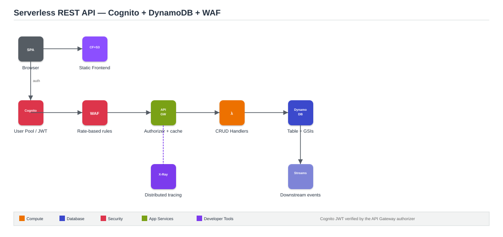

# Project 3: Serverless REST API with Cognito Auth, DynamoDB & WAF

**Architecture type:** Serverless REST API

## Table of Contents
- [Solution Overview](#solution-overview)
- [Architecture Diagram](#architecture-diagram)
- [Key AWS Services](#key-aws-services)
- [How It Works](#how-it-works)
- [Deploying This Solution](#deploying-this-solution)
- [Learning Outcomes](#learning-outcomes)
- [Cost Considerations](#cost-considerations)
- [Possible Enhancements](#possible-enhancements)
- [License](#license)

## Solution Overview
This project builds a serverless REST API (e.g., for a to-do or customer records app) using API Gateway, Lambda, and DynamoDB. Amazon Cognito User Pools provide authentication, WAF protects against abuse and bots, X-Ray gives distributed tracing across the call chain, and API Gateway caching reduces backend load. A CloudFront distribution sits in front of API Gateway for global edge delivery, and the frontend is a static React/Vue app hosted on S3.

## Architecture Diagram

*Figure 1: Cognito-authenticated requests flow through WAF and API Gateway to Lambda CRUD handlers backed by DynamoDB, with X-Ray tracing the full path.*

## Key AWS Services
| Service | Role |
|---|---|
| API Gateway | REST API, Cognito JWT authorizer, usage plans, response caching |
| Amazon Cognito | User Pool for sign-up/sign-in, hosted UI, JWT tokens |
| Lambda | CRUD handler functions with least-privilege IAM roles |
| DynamoDB | Table with GSIs, on-demand capacity, DynamoDB Streams |
| WAF | Rate-based rules, geo blocking, OWASP managed rule set |
| CloudFront | CDN in front of API Gateway for global edge caching |
| X-Ray | End-to-end tracing across API GW → Lambda → DynamoDB |
| S3 + CloudFront | Hosts and serves the static frontend |

## How It Works
1. A user signs in through the Cognito-hosted UI and receives a JWT.
2. The frontend (hosted on S3, served via CloudFront) calls the API with the JWT in the Authorization header.
3. Requests pass through WAF (rate limiting, OWASP rules) before reaching API Gateway.
4. API Gateway validates the JWT via a Cognito authorizer, checks its response cache, and invokes the appropriate Lambda CRUD function if not cached.
5. Lambda reads/writes to DynamoDB, using GSIs for alternate access patterns.
6. DynamoDB Streams can trigger downstream processing (e.g., notifications) on data changes.
7. X-Ray traces the full request path for debugging and latency analysis.

## Deploying This Solution

### Prerequisites
- An AWS account with console/CLI access
- A built static frontend (React/Vue) ready to deploy to S3

### Steps
1. Design and create the DynamoDB table with a primary key and at least one GSI.
2. Write Lambda CRUD functions with scoped IAM roles (read/write only what's needed).
3. Create the API Gateway REST API and wire routes to the Lambda functions.
4. Set up a Cognito User Pool, hosted UI, and attach a JWT authorizer to the API.
5. Enable API Gateway response caching on read-heavy routes.
6. Attach a WAF web ACL with rate-based rules in front of the API.
7. Enable X-Ray tracing on API Gateway and Lambda.
8. Deploy the frontend to S3 and put CloudFront in front of both the frontend and the API.

## Learning Outcomes
- Implement token-based authentication with Cognito and API Gateway authorizers.
- Design DynamoDB table schemas and GSIs for efficient access patterns.
- Apply WAF rules to protect APIs from abuse and injection attacks.
- Use X-Ray to trace and debug latency across a serverless call chain.
- Enable API Gateway caching to reduce Lambda invocations and cut cost.
- Understand DynamoDB Streams for triggering downstream event processing.

## Cost Considerations
Pay-per-use across the board (Lambda, DynamoDB on-demand, API Gateway requests). Cognito's free tier covers most demo usage. The main thing to watch is API Gateway caching, which has an hourly cost while enabled.

## Possible Enhancements
- Add a custom Cognito domain and MFA.
- Add fine-grained authorization (per-resource ownership checks) inside the Lambda functions.

## License
This project was built for educational purposes as part of an AWS Solutions Architecture project submission.
