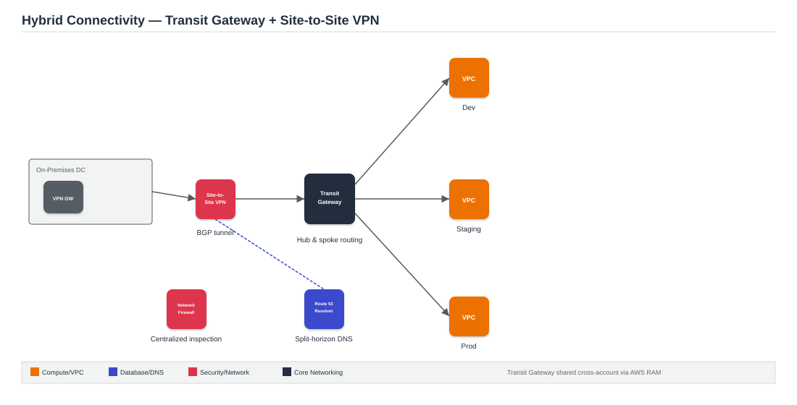

# Project 4: Hybrid Cloud Connectivity with Transit Gateway and Site-to-Site VPN

**Architecture type:** Hybrid / Network

## Table of Contents
- [Solution Overview](#solution-overview)
- [Architecture Diagram](#architecture-diagram)
- [Key AWS Services](#key-aws-services)
- [How It Works](#how-it-works)
- [Deploying This Solution](#deploying-this-solution)
- [Learning Outcomes](#learning-outcomes)
- [Cost Considerations](#cost-considerations)
- [Possible Enhancements](#possible-enhancements)
- [License](#license)

## Solution Overview
This project designs and implements a hybrid network architecture connecting an on-premises data center to AWS. An AWS Transit Gateway acts as the central network hub, with multiple VPCs (Dev, Staging, Prod) attached to it. A Site-to-Site VPN connection links on-premises to AWS, and Route 53 Resolver provides split-horizon DNS so on-premises hosts can resolve private AWS records and vice versa. The project also documents when Direct Connect would be preferred over VPN.

## Architecture Diagram

*Figure 1: Transit Gateway as the hub connecting Dev/Staging/Prod VPCs and an on-premises network over a BGP-routed Site-to-Site VPN.*

## Key AWS Services
| Service | Role |
|---|---|
| VPC (multiple) | Isolated VPCs per environment with non-overlapping CIDRs |
| Transit Gateway | Central hub; route tables, VPC attachments, VPN attachment |
| Site-to-Site VPN | IKEv2 tunnel to on-premises; BGP routing with ASN configuration |
| AWS Direct Connect | Dedicated-link alternative to VPN (documented, not required) |
| Route 53 Resolver | Inbound/outbound endpoints for hybrid DNS resolution |
| AWS RAM | Shares the Transit Gateway across AWS accounts |
| Network Firewall | Centralized inspection for inter-VPC and egress traffic |
| CloudTrail + Config | Audits network configuration changes |

## How It Works
1. An on-premises network (simulated with a software VPN endpoint on EC2, since physical on-prem hardware isn't available in this lab) establishes a Site-to-Site VPN tunnel with AWS, exchanging routes via BGP.
2. The VPN connection attaches to a Transit Gateway, which also has attachments to the Dev, Staging, and Prod VPCs.
3. Transit Gateway route tables control which VPCs can reach on-premises and each other (hub-and-spoke, not full mesh).
4. Route 53 Resolver endpoints allow DNS queries to cross the hybrid boundary in both directions.
5. Network Firewall inspects traffic between VPCs and on the way out to the internet.
6. CloudTrail and Config log and audit every network change for compliance.

## Deploying This Solution

### Prerequisites
- An AWS account with console/CLI access
- Basic familiarity with BGP routing concepts

### Steps
1. Create 3 VPCs (Dev/Staging/Prod) with carefully planned, non-overlapping CIDR blocks.
2. Create the Transit Gateway and attach all 3 VPCs.
3. Stand up a simulated on-premises VPN endpoint (e.g., strongSwan on EC2) since real on-prem hardware isn't available.
4. Establish the Site-to-Site VPN connection with BGP and attach it to the Transit Gateway.
5. Configure Transit Gateway route tables to control inter-VPC and on-prem routing.
6. Deploy Route 53 Resolver inbound/outbound endpoints for split-horizon DNS.
7. (Optional) Share the Transit Gateway via AWS RAM to a second account.
8. (Optional) Add Network Firewall for centralized traffic inspection.

## Learning Outcomes
- Architect multi-VPC networks using Transit Gateway as a hub-and-spoke model.
- Configure Site-to-Site VPN with BGP and understand static vs. dynamic routing.
- Compare Direct Connect vs. Site-to-Site VPN for bandwidth, cost, and reliability.
- Set up Route 53 Resolver endpoints for split-horizon DNS in hybrid environments.
- Use AWS RAM to share networking resources across accounts and organizations.
- Apply Network Firewall for centralized traffic inspection and east-west filtering.

## Cost Considerations
Transit Gateway attachments and the VPN connection both have hourly costs, plus data processing charges. This is one of the pricier projects to leave running — tear it down promptly after documenting and testing.

## Possible Enhancements
- Add a real Direct Connect simulation using a partner lab environment.
- Add Transit Gateway Network Manager for a visual topology view.

## License
This project was built for educational purposes as part of an AWS Solutions Architecture project submission.
