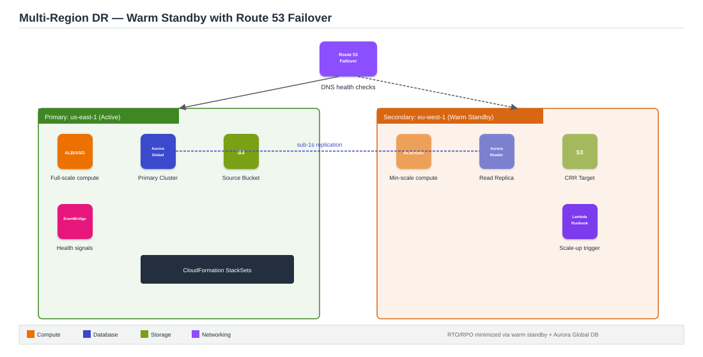

# Project 5: Multi-Region Disaster Recovery with Route 53 Failover

**Architecture type:** Hybrid / Disaster Recovery

## Table of Contents
- [Solution Overview](#solution-overview)
- [Architecture Diagram](#architecture-diagram)
- [Key AWS Services](#key-aws-services)
- [How It Works](#how-it-works)
- [Deploying This Solution](#deploying-this-solution)
- [Learning Outcomes](#learning-outcomes)
- [Cost Considerations](#cost-considerations)
- [Possible Enhancements](#possible-enhancements)
- [License](#license)

## Solution Overview
This project implements a multi-region disaster recovery strategy for a web application. The primary region (us-east-1) runs the full stack; the secondary region (eu-west-1) maintains warm standby resources. Route 53 health checks detect primary-region failure and automatically fail DNS over to the secondary region. The project documents and compares all four AWS DR strategies — Backup & Restore, Pilot Light, Warm Standby, and Multi-Site Active-Active — and implements the **Warm Standby** pattern.

## Architecture Diagram

*Figure 1: Active primary region and warm-standby secondary region, kept in sync via Aurora Global Database and S3 CRR, with Route 53 failover routing between them.*

## Key AWS Services
| Service | Role |
|---|---|
| Route 53 | Failover routing policy, health checks, DNS TTL tuning |
| Aurora Global Database | Primary cluster + read-only replica in secondary region (sub-1s RPO) |
| S3 Cross-Region Replication | Replicates user data and static assets to the secondary region |
| DynamoDB Global Tables | Multi-region active-active replication for low-latency reads |
| EC2 + ASG (both regions) | Warm standby: minimal instances, scale up on failover |
| CloudFormation StackSets | Deploys identical infrastructure across regions consistently |
| AWS Backup | Centralized backup plans for RDS, EC2, and S3 |
| CloudWatch + EventBridge | Cross-region alarms; triggers failover automation via Lambda |

## How It Works
1. The primary region (us-east-1) runs the full Project 1-style stack, actively serving traffic.
2. The secondary region (eu-west-1) runs a scaled-down "warm" version of the same stack — enough to take over quickly, not enough to serve full production load on its own.
3. Aurora Global Database replicates the primary database to the secondary region with sub-1-second RPO; S3 Cross-Region Replication keeps static assets in sync.
4. Route 53 health checks continuously probe the primary region's endpoint.
5. On failure, Route 53's failover routing policy shifts DNS to the secondary region's ALB.
6. An EventBridge rule detects the failover event and triggers a Lambda runbook to scale up the secondary region's Auto Scaling Group to full capacity.

## Deploying This Solution

### Prerequisites
- An AWS account with console/CLI access
- The Project 1 stack already deployed (used as the primary-region baseline)

### Steps
1. Deploy the Project 1 stack in us-east-1 as the primary, full-scale environment.
2. Deploy a minimal warm-standby version of the same stack in eu-west-1 (low desired ASG capacity).
3. Convert the database to Aurora Global Database with a secondary-region reader.
4. Enable S3 Cross-Region Replication for static assets.
5. Configure Route 53 failover routing with health checks against the primary ALB.
6. Use CloudFormation StackSets to keep both regions' infrastructure consistent.
7. Build an EventBridge + Lambda runbook that scales up the secondary region on failover.
8. Test by simulating a primary-region failure and timing the actual failover (RTO).

## Learning Outcomes
- Understand and compare the four AWS DR strategies by RTO, RPO, and cost.
- Configure Route 53 failover routing with health checks and DNS TTL considerations.
- Use Aurora Global Database for near-zero RPO cross-region database replication.
- Implement S3 Cross-Region Replication with replication rules and IAM roles.
- Deploy multi-region infrastructure consistently using CloudFormation StackSets.
- Design recovery automation using EventBridge rules and Lambda-driven runbooks.

## Cost Considerations
This is the most expensive project to run continuously: two regions' worth of infrastructure, cross-region data transfer, and Aurora Global Database replication all add cost. Keep the secondary region's ASG at minimum capacity until you're actively testing failover.

## Possible Enhancements
- Automate a full DR game-day test with scripted failure injection and RTO/RPO measurement.
- Add Route 53 Application Recovery Controller for more sophisticated failover control.

## License
This project was built for educational purposes as part of an AWS Solutions Architecture project submission.
