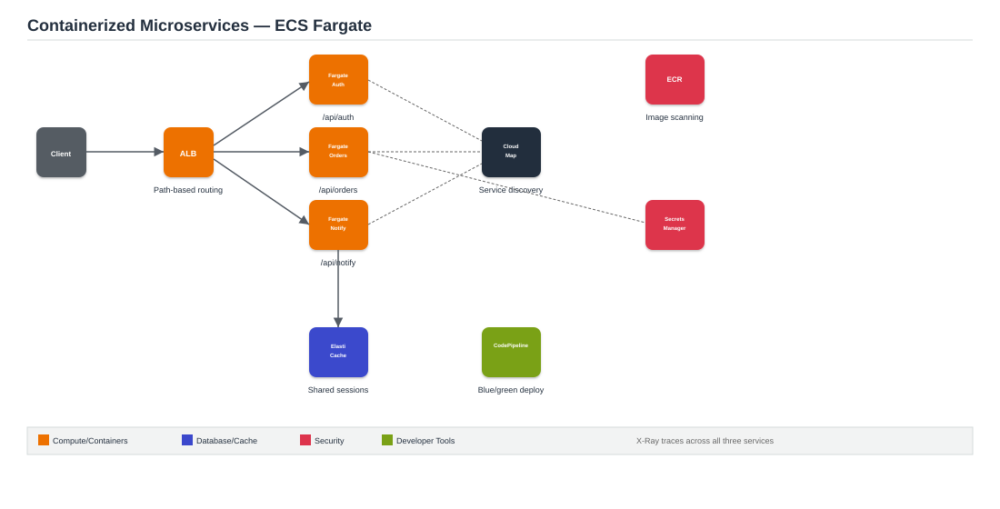

# Project 6: Containerized Microservices with ECS Fargate and Service Discovery

**Architecture type:** Containers

## Table of Contents
- [Solution Overview](#solution-overview)
- [Architecture Diagram](#architecture-diagram)
- [Key AWS Services](#key-aws-services)
- [How It Works](#how-it-works)
- [Deploying This Solution](#deploying-this-solution)
- [Learning Outcomes](#learning-outcomes)
- [Cost Considerations](#cost-considerations)
- [Possible Enhancements](#possible-enhancements)
- [License](#license)

## Solution Overview
This project migrates a monolithic Node.js application into three microservices — Auth, Orders, and Notifications — running on Amazon ECS Fargate. Services communicate via AWS Cloud Map for service discovery, with an Application Load Balancer handling external traffic via path-based routing. Secrets are stored in AWS Secrets Manager and injected at runtime. CodePipeline and CodeDeploy provide blue/green container deployments, and ElastiCache Redis handles shared session caching across stateless container instances.

## Architecture Diagram

*Figure 1: ALB routes by path to three ECS Fargate services that discover each other via Cloud Map, share session state via Redis, and deploy through a blue/green CI/CD pipeline.*

## Key AWS Services
| Service | Role |
|---|---|
| ECS Fargate | Task definitions, services, capacity providers; no server management |
| ECR | Private container registry with vulnerability scanning on push |
| ALB + Target Groups | Path-based routing to multiple ECS services |
| AWS Cloud Map | DNS-based service discovery between containers |
| Secrets Manager | Injects database credentials and API keys at runtime |
| ElastiCache (Redis) | Shared session store across stateless containers |
| CodePipeline + CodeDeploy | CI/CD with blue/green deployment and automatic rollback |
| X-Ray | Distributed tracing with service map visualization |

## How It Works
1. A client request hits the ALB, which routes it by path — `/api/auth`, `/api/orders`, `/api/notify` — to the corresponding ECS Fargate service.
2. Each ECS service registers itself with Cloud Map, allowing services to discover and call each other via DNS names instead of hardcoded IPs.
3. Task definitions pull secrets (DB credentials, API keys) from Secrets Manager at container startup rather than storing them in the image or environment variables directly.
4. Session state is stored in ElastiCache Redis, shared across all container instances so any instance can serve any user's request.
5. CodePipeline builds new images, pushes to ECR (which scans for vulnerabilities), and CodeDeploy performs a blue/green rollout with automatic rollback if health checks fail.
6. X-Ray captures the full request path across services for debugging and a visual service map.

## Deploying This Solution

### Prerequisites
- An AWS account with console/CLI access
- Docker installed locally for building images

### Steps
1. Split the application into three services conceptually: Auth, Orders, Notifications.
2. Dockerize each service and push images to ECR.
3. Create ECS Fargate task definitions and services for each microservice.
4. Configure Cloud Map for service discovery.
5. Create an ALB with path-based routing rules to the three services.
6. Store credentials in Secrets Manager and reference them in task definitions.
7. Deploy ElastiCache Redis for shared sessions.
8. Set up CodePipeline + CodeDeploy for blue/green deployments.
9. Enable X-Ray tracing across all services.

## Learning Outcomes
- Build and push Docker images to ECR and configure ECS task definitions.
- Design ECS Fargate services with correct IAM task roles and execution roles.
- Implement service-to-service communication using Cloud Map DNS-based discovery.
- Configure ALB path-based routing rules to front multiple microservices.
- Set up blue/green deployments using CodeDeploy with ECS integration.
- Manage secrets securely with Secrets Manager and avoid hardcoded credentials.

## Cost Considerations
Fargate is billed per vCPU/memory-second while tasks run, so scale services down to their minimum when not demoing. ElastiCache runs continuously and is one of the pricier idle components — consider stopping it between sessions.

## Possible Enhancements
- Add ECS Service Auto Scaling based on request count per target.
- Add a service mesh (App Mesh) for more advanced traffic management and observability.

## License
This project was built for educational purposes as part of an AWS Solutions Architecture project submission.
