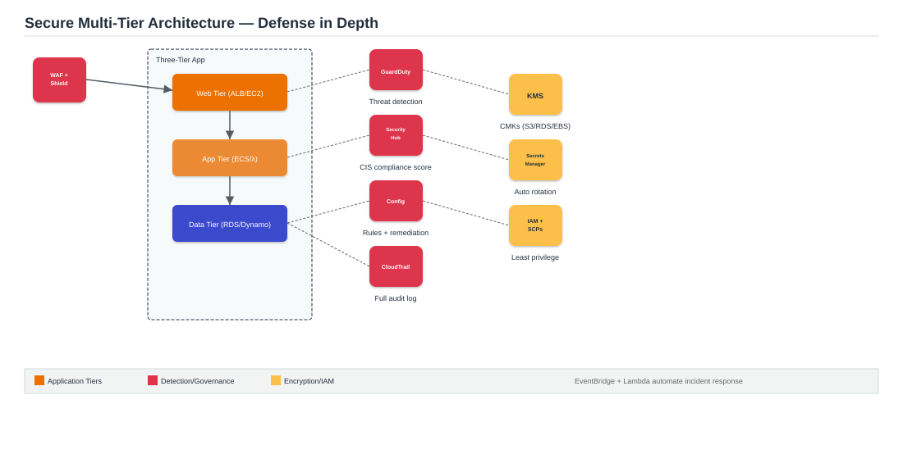

# Project 8: Secure Multi-Tier Architecture with GuardDuty, KMS & Security Hub

**Architecture type:** Security

## Table of Contents
- [Solution Overview](#solution-overview)
- [Architecture Diagram](#architecture-diagram)
- [Key AWS Services](#key-aws-services)
- [How It Works](#how-it-works)
- [Deploying This Solution](#deploying-this-solution)
- [Learning Outcomes](#learning-outcomes)
- [Cost Considerations](#cost-considerations)
- [Possible Enhancements](#possible-enhancements)
- [License](#license)

## Solution Overview
This project designs and implements a defense-in-depth security architecture for a three-tier application (web, app, data). It applies encryption at rest and in transit, centralized secret management, automated threat detection, compliance auditing, and incident response automation using EventBridge and Lambda. The architecture maps directly to the Security domain of the SAA-C03 exam and the AWS Well-Architected Framework Security Pillar.

## Architecture Diagram

*Figure 1: A three-tier application wrapped in defense-in-depth controls — KMS encryption, Secrets Manager rotation, GuardDuty/Security Hub/Config for detection and compliance, and IAM/SCPs for least privilege.*

## Key AWS Services
| Service | Role |
|---|---|
| AWS KMS | Customer-managed keys (CMKs) encrypting S3, RDS, EBS, and SSM Parameter Store |
| Secrets Manager | Automatic credential rotation for RDS; full audit log of secret access |
| GuardDuty | Threat detection — unusual API calls, crypto-mining, reconnaissance |
| Security Hub | Aggregated findings from all services; CIS AWS Benchmark compliance score |
| AWS Config | Detects and auto-remediates non-compliant resources via Config Rules + SSM |
| CloudTrail | Full API audit log across all regions with log integrity validation |
| WAF + Shield Standard | Edge protection against SQLi, XSS, and volumetric DDoS |
| IAM + SCPs | Least-privilege roles, permission boundaries, deny-root-usage policies |

## How It Works
1. The three-tier application (web/app/data, reusing the pattern from Project 1) has every data store — S3, RDS, EBS, SSM parameters — encrypted with customer-managed KMS keys rather than AWS-managed defaults, giving fine-grained control over key policies and access.
2. RDS credentials live in Secrets Manager with automatic rotation via a Lambda rotation function; every access is logged.
3. GuardDuty continuously analyzes VPC Flow Logs, DNS logs, and CloudTrail events to detect threats like reconnaissance or crypto-mining.
4. Security Hub aggregates GuardDuty findings alongside other service findings and scores the account against the CIS AWS Benchmark and PCI DSS.
5. AWS Config continuously evaluates resources against custom rules (e.g., "no public S3 buckets") and can auto-remediate violations via SSM documents.
6. CloudTrail logs every API call across all regions with integrity validation enabled, feeding both Security Hub and manual audits.
7. WAF and Shield Standard sit at the edge, blocking common web exploits and absorbing volumetric DDoS attempts.
8. When GuardDuty raises a finding, an EventBridge rule triggers a Lambda function that can automatically isolate the affected resource or notify the security team.

## Deploying This Solution

### Prerequisites
- An AWS account with console/CLI access
- An existing three-tier application to secure (e.g., the Project 1 stack), or a fresh deployment of one

### Steps
1. Create KMS customer-managed keys and re-encrypt existing S3/RDS/EBS/SSM resources with them.
2. Enable Secrets Manager automatic rotation for the RDS instance using a Lambda rotation function.
3. Enable GuardDuty and review its finding types.
4. Enable Security Hub with the CIS AWS Foundations Benchmark standard.
5. Write 1–2 custom AWS Config Rules and attach SSM auto-remediation documents.
6. Enable CloudTrail across all regions with log file integrity validation.
7. Attach WAF (OWASP managed rules) and confirm Shield Standard coverage on the ALB/CloudFront.
8. Apply IAM permission boundaries and a deny-root-usage SCP (if using AWS Organizations).
9. Build an EventBridge rule + Lambda function that reacts to a sample GuardDuty finding.

## Learning Outcomes
- Apply KMS customer-managed keys with key policies and grant-based access controls.
- Configure Secrets Manager automatic rotation for RDS using a Lambda rotation function.
- Enable GuardDuty and interpret finding types (Recon, Backdoor, CryptoCurrency).
- Aggregate findings in Security Hub and map them to CIS and PCI DSS compliance frameworks.
- Write Config Rules and attach SSM remediation documents for automatic non-compliance fixes.
- Design IAM least-privilege roles using permission boundaries and organization-level SCPs.

## Cost Considerations
GuardDuty, Security Hub, and Config all bill based on the volume of events/resources evaluated — costs scale with account activity but are generally modest for a demo-sized account. KMS CMKs have a small monthly per-key cost.

## Possible Enhancements
- Add Amazon Detective for deeper investigation of GuardDuty findings.
- Add automated Security Hub finding remediation via Systems Manager Automation runbooks.

## License
This project was built for educational purposes as part of an AWS Solutions Architecture project submission.
